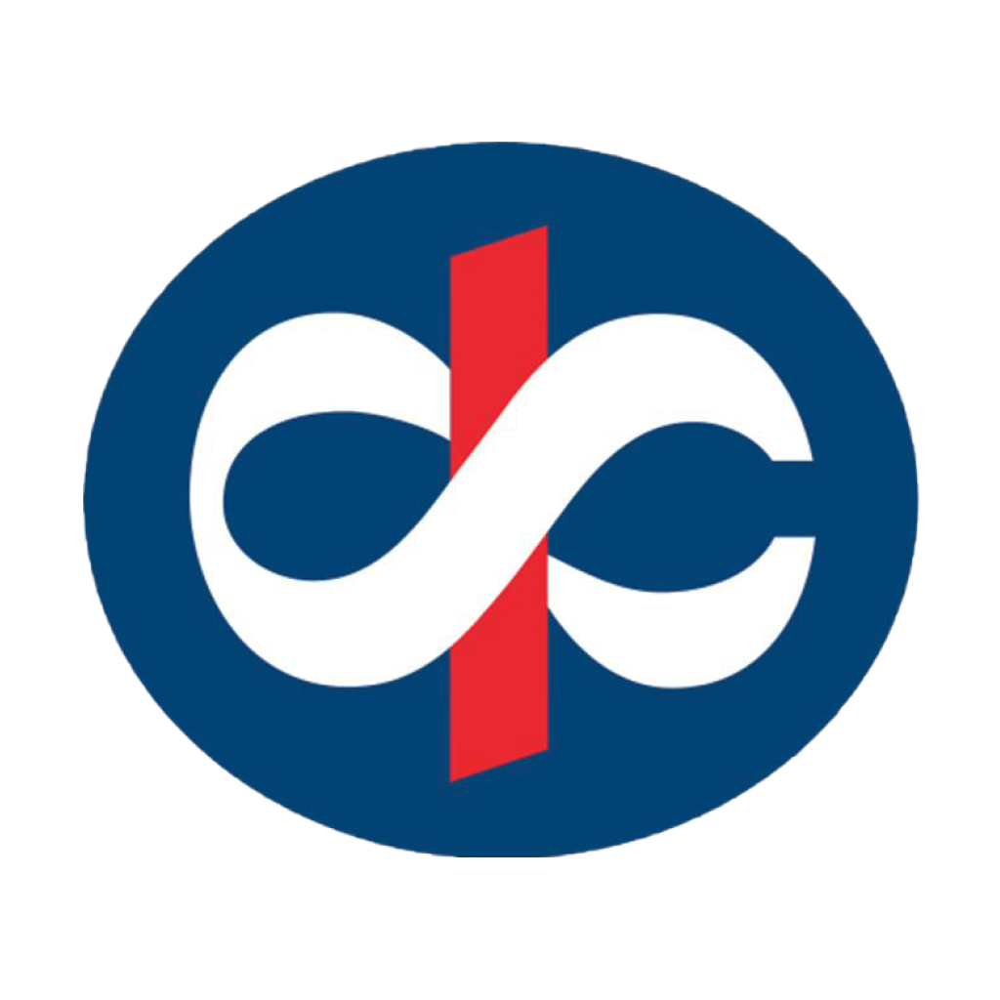

<!-- PROJECT LOGO -->
<br />
<p align="center">
  <a href="https://bp-gc.in/kotak-refs">
    
  </a>

  <h1 align="center">KEF Volunteering App</h1>

  <p align="center">
    A full-stack mobile application made for the Kotak Education Foundation as part of my virtual internship in the Summer of 2021. 
    <br />
    <a href="https://drive.google.com/file/d/1R_HgGJGehIbOtvHcfdgtbMYTitb6dw11/view?usp=sharing"><strong>View the Project Report »</strong></a>
    <br />
    <br />
    <a href="https://drive.google.com/file/d/1fhqfnFTph3maDRnhcM7YmYoQp1nGF_UG/view?usp=sharing">View Demo APK</a>
  </p>
</p>


<!-- TABLE OF CONTENTS -->
<details open="open">
  <summary>Table of Contents</summary>
  <ol>
    <li>
      <a href="#about-the-project">About The Project</a>
      <ul>
        <li><a href="#built-with">Built With</a></li>
      </ul>
    </li>
    <li>
      <a href="#getting-started">Getting Started</a>
      <ul>
        <li><a href="#prerequisites">Prerequisites</a></li>
        <li><a href="#installation">Installation</a></li>
      </ul>
    </li>
    <li><a href="#usage">Usage</a></li>
    <li><a href="#project-report">Project Report</a></li>
  </ol>
</details>


<!-- ABOUT THE PROJECT -->
## About The Project

Kotak Education Foundation (KEF) is an NGO operating in the space of education and livelihood since 2007. Its primary focus is to help poor children and youth to be empowered through education and livelihood respectively. <br/> <br/>
A major hurdle with the management of such a vast range of activities and people from different backgrounds, especially remotely, was that there was no efficient way set up to communicate details about various activities from Volunteers to Beneficiaries and vice-versa. Being that both Volunteers and Beneficiaries generally come from non-technical backgrounds, several tasks, like filling important forms regularly, became quite inconvenient and unnecessarily complicated, which hindered the efficiency of the programmes. The KEF Members had to manually call each volunteer and beneficiary to inform them of the upcoming scheduled activities and sessions, and then call them again for their feedback on whatever activity they conducted or attended.
<br/> <br/>
As interns, our methodology for solving this critical problem was simple - we created a mobile application that serves as a one-stop for both Volunteers and Beneficiaries, as well as any third party Intervention managers. This application consists of the several forms that were previously spread out across various links, and allows a user to find what they want easily. The app also allows new members to Sign Up and Join the KEF as either a Volunteer or a Beneficiary.
<br/><br>
<strong>This repository contains the code for the front-end of the application, written in React Native. The code for the back-end is available [here](https://github.com/shameekbaranwal/KEF-API).</strong>

### Built With

* [React Native](https://reactnative.dev/)
* [Expo](https://expo.io/)
* [Formik](https://formik.org/)


<!-- GETTING STARTED -->
## Getting Started with the Demo

You can either access the app in the production environment by downloading the APK file from [here]('https://bp-gc.in/kotak-refs) and installing it on your device, or you can access it in a development environment using Expo CLI by following these steps.

### Prerequisites

First, you need to make sure you have a stable version of expo and expo-cli installed.

* npm
  ```sh
  npm install expo expo-cli -g
  ```

### Installation

1. Make sure the API hosted on [Heroku](https://vast-river-10450.herokuapp.com/api) is functional by making a POST request at the `/api/login` endpoint. Source code for the API is available [here](https://github.com/shameekbaranwal/KEF-API).
   
2. Clone this repo
   ```sh
   git clone https://github.com/shameekbaranwal/KEF-Volunteering.git
   ```

3. Install NPM packages
   ```sh
   npm i
   ```
   
4. Start the application in development mode using
   ```sh
   expo start
   ```

5. Run the application on your android device or android emulator by following the instructions in [Expo's documentation](https://docs.expo.dev/get-started/installation/#2-expo-go-app-for-ios-and).


<!-- USAGE EXAMPLES -->
## Usage

On opening the page, you'll be greeted with the following screen <br/>

 <br/>

Since this is a Demo version of the application not connected to the actual database, you can test the features of the application by logging in using the following credentials in the login screen displayed ahead.
```
Email: a@a.com
Phone: 1234567890
```

<br/> <br/>

Upon logging in, you'll reach the dashboard, where you have the option to view the live Activity Schedule, or fill the log sheets or feedback forms after attending a particular activity.

<br/>  <br/>

Within the activity schedule, you have the option to browse the activities in the Calendar View, or search for the relevant activity in the Search View.

<br/>
<p float="left">
  
  
</p>
<br/>

## Project Report

Further details regarding the functionality and codebase of the application project is available in the project report available [here](https://bp-gc.in/kotak-refs).